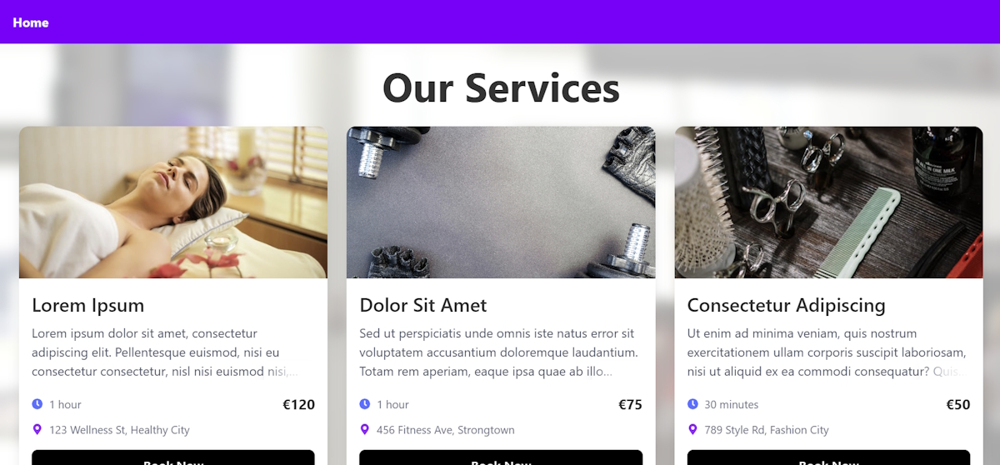
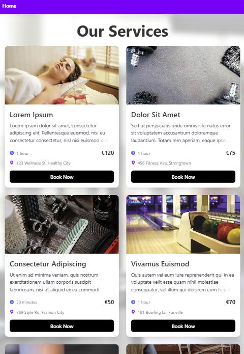
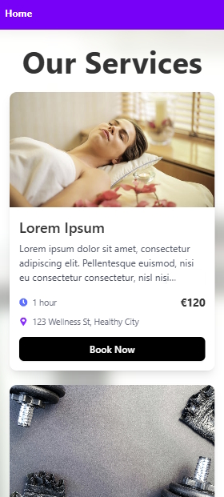
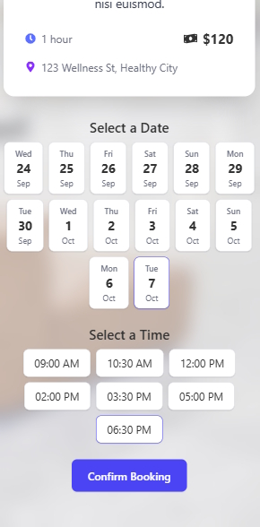

# Booking App

This is a modern React-based booking application for all kinds of service providers. Users can browse available services, view details, and book appointments directly through the app. The app features:

- Service listing with images, descriptions, prices, and locations
- Detailed service pages with booking flow (date and time selection)
- Confirmation modal for successful bookings
- Responsive design with attractive backgrounds and overlays
- Navigation and footer for a complete user experience

Built with React, TypeScript, Vite, Tailwind CSS, and React Router.

---

<a href="https://book-your-service.netlify.app/" target="_blank" rel="noopener noreferrer">Live Demo – Visit the app here!</a>

## Screenshots

### Page
- Desktop (≥1280px)
  
  

- Tablet (~768–1024px)
  
  

- Mobile (≤430px)
  
  

  

